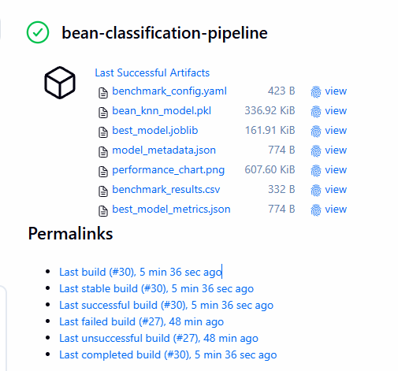

# Dry Bean Morphological Classification - Model Benchmarking

### Project Overview
This repository implements an end-to-end machine learning pipeline designed to classify seven distinct varieties of dry beans utilizing high-dimensional morphological and geometric data. The project features a comprehensive model benchmarking framework that evaluates multiple algorithms to identify the optimal classifier for automated agricultural sorting.

### Technical Performance
* **Best Model Accuracy:** 94.2% (Support Vector Machine with RBF Kernel)
* **Feature Space:** 21-Dimensional (Morphological & Geometric)
* **Dataset Size:** 2,500 samples with 7 bean classes
* **Evaluation Method:** 5-fold Stratified Cross-Validation + Holdout Test Set

---

## Phase2 Benchmark Results

The benchmark evaluated 6 different machine learning algorithms to identify the best performing model:

| Model | CV Accuracy (Mean) | CV Accuracy (Std) | Holdout Accuracy | Macro F1 Score |
|-------|-------------------|-------------------|------------------|----------------|
| **SVM** | 92.75% | 1.26% | **94.20%** | 0.9498 |
| Logistic Regression | 92.35% | 0.82% | 94.00% | 0.9475 |
| KNN | 91.50% | 1.39% | 94.00% | 0.9471 |
| Random Forest | 91.80% | 0.76% | 93.40% | 0.9404 |
| Gaussian NB | 90.75% | 0.94% | 91.40% | 0.9192 |
| Decision Tree | 89.80% | 1.62% | 91.00% | 0.9192 |

**Winner:** Support Vector Machine (SVM) with RBF kernel achieved the highest holdout accuracy of 94.2%, representing a 4.2% improvement over the baseline KNN model.

---

### System Architecture
The project utilizes a **modular, configuration-driven architecture** with strict separation of concerns:

* **`config/benchmark_config.yaml`**: Centralized configuration for paths, training parameters, and model selection
* **`Scripts/data_alignment.py`**: Data preprocessing pipeline that ensures dataset consistency
* **`Scripts/benchmark_models.py`**: Model benchmarking engine with cross-validation and automated evaluation
* **`Scripts/visualize_results.py`**: Visualization module for generating performance charts
* **`Scripts/config_utils.py`**: Configuration loading utilities
* **`models/best_model.joblib`**: Serialized best-performing model (SVM)
* **`models/model_metadata.json`**: Model metadata and feature information
* **`reports/benchmark_results.csv`**: Complete benchmark results for all models
* **`reports/best_model_metrics.json`**: Detailed metrics for the best model

---

### Engineering Principles
1. **Configuration-Driven Design:** All hyperparameters and paths externalized to YAML for easy experimentation
2. **Model Persistence:** Leverages `joblib` for efficient object serialization
3. **Feature Normalization:** StandardScaler applied to ensure feature parity across algorithms
4. **Reproducibility:** Fixed random states and standardized `requirements.txt` for consistent environments
5. **Modular Pipeline:** Clear separation between data preparation, training, evaluation, and visualization

---

## Installation and Deployment

### 1. Environment Setup
```powershell
python -m venv .venv
.\.venv\Scripts\activate
pip install -r requirements.txt
```

### 2. Run Complete Pipeline
```powershell
# Step 1: Data alignment
python Scripts\data_alignment.py

# Step 2: Run model benchmark
python Scripts\benchmark_models.py

# Step 3: Generate visualizations
python Scripts\visualize_results.py
```

### 3. View Results
```powershell
# View benchmark comparison
notepad reports\benchmark_results.csv

# View best model details
notepad reports\best_model_metrics.json
```

---

## Configuration

The benchmark behavior is controlled via `config/benchmark_config.yaml`:

```yaml
paths:
  data_path: Data_sets/train_dataset.csv
  model_dir: models
  report_dir: reports

training:
  random_state: 50
  cv_splits: 5
  test_size: 0.2

models:
  enabled:
    - logistic_regression
    - knn
    - decision_tree
    - random_forest
    - svm
    - gaussian_nb
```

To customize the benchmark:
- Add/remove models from the `enabled` list
- Adjust training parameters (random_state, cv_splits, test_size)
- Modify paths for data, models, and reports

---

## Performance Visualization

The benchmark chart (`performance_chart.png`) is generated during pipeline execution and archived as a Jenkins artifact.

The visualization includes:
- Holdout accuracy comparison across all models
- Cross-validation vs holdout accuracy scatter plot
- Macro F1 score comparison
- Comprehensive metrics table with best model highlighted

---

## Key Performance Metrics

| Metric | Value |
| :--- | :--- |
| **Best Model** | **SVM (RBF Kernel)** |
| **Best Holdout Accuracy** | **94.20%** |
| **Best Macro F1 Score** | **0.9498** |
| **Dataset Size** | 2,500 samples |
| **Feature Count** | 21 morphological features |
| **Number of Classes** | 7 bean varieties |
| **Cross-Validation** | 5-fold Stratified |

---

## Project Structure

```
Karunadu Project/
├── config/
│   └── benchmark_config.yaml      # Configuration file
├── Data_sets/
│   ├── Dry_Beans_Dataset.csv      # Original dataset
│   └── train_dataset.csv           # Processed dataset
├── models/
│   ├── best_model.joblib          # Trained SVM model
│   └── model_metadata.json         # Model metadata
├── reports/
│   ├── benchmark_results.csv      # All model results
│   └── best_model_metrics.json    # Best model details
├── Scripts/
│   ├── benchmark_models.py         # Benchmarking engine
│   ├── data_alignment.py          # Data preprocessing
│   ├── visualize_results.py       # Visualization generator
│   └── config_utils.py            # Config utilities
├── requirements.txt                # Python dependencies
└── performance_chart.png          # Results visualization
```

---

## Phase3: CI/CD with Docker and Jenkins

### Overview
Phase3 adds production-grade CI/CD capabilities using Dockerized execution and Jenkins orchestration. The pipeline now runs fully without external artifact repositories and archives outputs to Jenkins and VM storage.

### Components

#### 1. Docker containerization
- **`Dockerfile`**: Builds runtime image with project scripts, config, and base dataset.
- **`docker-compose.yml`**: Local development/test orchestration.
- **`.dockerignore`**: Reduces Docker build context.

#### 2. Jenkins declarative pipeline with `vars/` modularization
- **`Jenkinsfile`**: Stage orchestration.
- **`vars/docker.groovy`**: Docker helpers (`buildImage`, `runCommand`, `removeImage`).
- **`vars/pipeline.groovy`**: Pipeline stage implementations.

#### 3. Artifact strategy (current)
- Jenkins `archiveArtifacts` is used for build outputs.
- VM/local output directory (`/tmp/bean-classification-output`) stores copied artifacts.
- No JFrog dependency in current Phase3 flow.

### Final Jenkins pipeline stages
1. **Checkout** - pull branch source.
2. **Build Docker Image** - build `bean-classification:${BUILD_NUMBER}`.
3. **Run Data Alignment** - generate `train_dataset.csv` and copy it into Jenkins workspace in the same container lifecycle.
4. **Run Model Benchmarking** - train/evaluate models and persist model/report outputs.
5. **Generate Visualizations** - produce `performance_chart.png`.
6. **Archive Artifacts to VM** - copy models/reports/chart/config to output directory and archive in Jenkins.
7. **Cleanup** - remove build image.

### Important implementation notes
- Data alignment uses the container's built-in source dataset and copies generated `train_dataset.csv` to mounted workspace path.
- `vars/docker.groovy` executes commands using `sh -c` inside container so compound commands run in-container.
- Visualization font is set to a container-safe default (`DejaVu Sans`) to avoid font warnings in Linux/Jenkins containers.

### Jenkins setup (current)
1. Install required plugins:
   - Docker Pipeline
   - Credentials Binding (for SCM credentials or other Jenkins credentials you use)
2. Create pipeline job:
   - **Pipeline script from SCM**
   - repository URL
   - branch: `usr/Jagadev/Phase3`
   - script path: `Jenkinsfile`
3. Ensure Jenkins agent can access Docker daemon.
4. Run **Build Now** and monitor stages.

### Jenkins run evidence (Build #30)

Latest validated run completed with:
- **Status**: `Finished: SUCCESS`
- **Branch/Commit**: `usr/Jagadev/Phase3` / `02fc202`
- **Image tag**: `bean-classification:30`
- **Jenkins UI**: Last Successful Build artifact panel confirms archived outputs.

Stage completion observed in console output:
- Checkout
- Build Docker Image
- Run Data Alignment
- Run Model Benchmarking
- Generate Visualizations
- Archive Artifacts to VM
- Cleanup

Benchmark highlights from the same run:
- **Best model**: `random_forest`
- **Holdout Accuracy**: `0.9324` (93.24%)
- **Macro F1 Score**: `0.942767`
- **CV Accuracy**: `0.9235 +/- 0.0037`

Archived artifacts visible in Jenkins:
- `benchmark_config.yaml`
- `best_model.joblib`
- `model_metadata.json`
- `performance_chart.png`
- `benchmark_results.csv`
- `best_model_metrics.json`

### Jenkins artifact snapshot

The following screenshot shows the successful Jenkins run and archived artifacts for the pipeline.



### Phase3 project structure

```
Karunadu Project/
├── Dockerfile
├── docker-compose.yml
├── Jenkinsfile
├── .dockerignore
├── pipeline-main.groovy
├── vars/
│   ├── docker.groovy
│   └── pipeline.groovy
├── config/
│   └── benchmark_config.yaml
├── Data_sets/
├── models/
├── reports/
├── Scripts/
└── requirements.txt
```

### Benefits
- **Reproducibility**: consistent runtime through Docker image build.
- **Automation**: end-to-end CI execution in Jenkins.
- **Traceability**: build-numbered Docker image and archived artifacts per run.
- **Operational simplicity**: no external artifact repository dependency for current scope.

---

## License
This project is released under the MIT License. Feel free to use, modify, and distribute as per the license terms.
