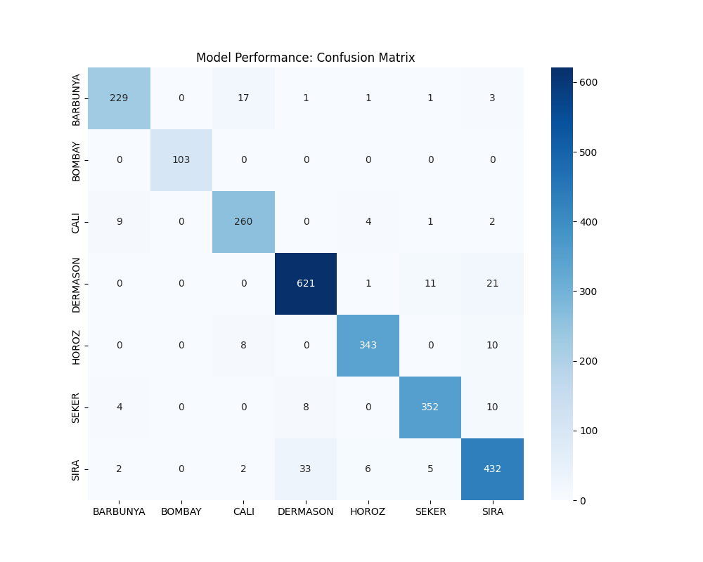

# Dry Bean Morphological Classification via K-Nearest Neighbors

### Project Overview
This repository implements an end-to-end machine learning pipeline designed to classify seven distinct varieties of dry beans utilizing high-dimensional morphological and geometric data. By leveraging 16 distinct features, the system achieves a high degree of precision in automated agricultural sorting.

### Technical Performance
* **Model Accuracy:** 90.0% (Generalization Accuracy)
* **Algorithm:** K-Nearest Neighbors (KNN)
* **Feature Space:** 16-Dimensional (Morphological & Geometric)
* **Data Transformation:** Standardized via `StandardScaler` to ensure Euclidean distance parity across heterogeneous feature scales.

---

### System Architecture
The project utilizes a **decoupled architecture**, strictly separating the training pipeline from the inference engine. This modularity ensures the system is ready for containerization or integration into a larger microservices ecosystem.

* **`bean_classifier.py`**: The Training Pipeline. Handles data ingestion, feature scaling, model fitting, and automated evaluation.
* **`predict.py`**: The Inference Engine. A CLI-based utility that loads serialized artifacts to perform real-time classification on new data points.
* **`knn_classifier_model.pkl`**: Serialized model artifact representing the trained state of the classifier.
* **`scaler.pkl`**: Serialized transformation parameters required to maintain data consistency during inference.

---

### Engineering Principles
1. **Model Persistence:** Leverages `joblib` for efficient object serialization, enabling rapid deployment without the overhead of retraining.
2. **Feature Normalization:** Essential for distance-based algorithms, the pipeline ensures that high-magnitude features (e.g., Area) do not disproportionately influence the classification relative to fractional features (e.g., Shape Factors).
3. **Reproducibility:** The split-test methodology utilizes fixed random states to ensure consistent performance metrics across different execution environments.

---

### Installation and Deployment

**1. Environment Isolation**
Initialize a clean virtual environment to manage dependencies:
```bash
python -m venv env
.\env\Scripts\activate

